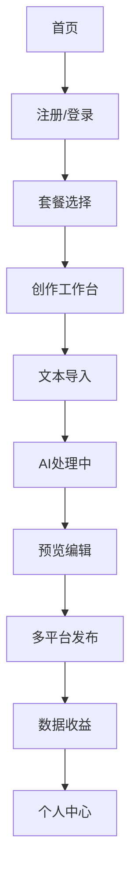

## 1. 产品概述

网文转视频自动化SaaS平台，通过AI技术将热门网络小说自动转换为高质量视频内容。解决内容创作者视频制作成本高、效率低的问题，帮助网文作者和MCN机构快速实现内容变现。

目标市场：网文平台、内容创作者、MCN机构、短视频创作者，预计市场规模达数十亿元。

## 2. 核心功能

### 2.1 用户角色

| 角色   | 注册方式 | 核心权限                  |
| ---- | ---- | --------------------- |
| 免费用户 | 邮箱注册 | 每月3次免费转换，基础模板，带水印导出   |
| 专业用户 | 付费订阅 | 无限制转换，高级模板，无水印，多平台发布  |
| 企业用户 | 商务合作 | 批量处理，API接入，定制化模板，专属客服 |

### 2.2 功能模块

核心页面列表：

1. **首页**：产品展示、价格方案、用户案例、开始创作按钮
2. **创作工作台**：文本导入、AI处理进度、预览编辑、导出管理
3. **个人中心**：账户信息、订阅管理、使用统计、作品库
4. **支付中心**：套餐选择、订单管理、发票申请

### 2.3 页面详情

| 页面名称  | 模块名称    | 功能描述                  |
| ----- | ------- | --------------------- |
| 首页    | Hero展示区 | 展示产品核心价值，包含演示视频和CTA按钮 |
| 首页    | 功能特色    | 介绍AI转换、多平台发布、商业化能力    |
| 首页    | 价格方案    | 展示不同套餐对比，突出性价比        |
| 创作工作台 | 文本导入    | 支持粘贴文本、文件上传、URL抓取     |
| 创作工作台 | AI处理中心  | 实时显示脚本生成、图片生成、视频合成进度  |
| 创作工作台 | 预览编辑    | 提供时间轴编辑、字幕调整、配音选择     |
| 创作工作台 | 导出设置    | 选择分辨率、平台格式、水印设置       |
| 个人中心  | 作品管理    | 查看历史作品、重新编辑、下载管理      |
| 个人中心  | 使用统计    | 显示本月使用次数、剩余额度、消费记录    |
| 支付中心  | 套餐选择    | 月付/年付选项，企业定制入口        |
| 支付中心  | 订单历史    | 查看所有交易记录，支持退款申请       |

## 3. 核心流程

用户操作流程：

1. 用户注册登录 → 2. 选择套餐或试用 → 3. 进入创作工作台 → 4. 导入网文内容 → 5. AI自动处理（脚本→图片→视频）→ 6. 预览编辑调整 → 7. 选择发布平台 → 8. 一键多平台发布 → 9. 查看数据收益

## 4. 用户界面设计

### 4.1 设计风格

* **主色调**：科技蓝(#1890ff)搭配纯白背景，营造专业可信感

* **辅助色**：渐变紫(#722ed1)用于强调和按钮悬停效果

* **按钮样式**：圆角矩形，主要按钮使用渐变色，次要按钮使用描边

* **字体选择**：中文使用思源黑体，英文使用Inter，标题18-24px，正文14px

* **布局风格**：左侧导航+右侧主内容区域，卡片式信息展示

