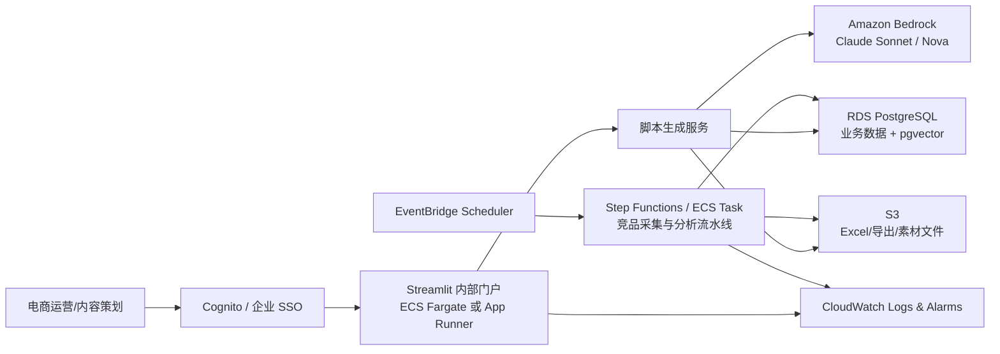

# 海外电商视频脚本生成平台 AWS 内部上线方案

## 1. 当前状态

当前 demo 是 Streamlit 单体应用，核心文件为 `app.py`。它已经具备以下能力：

- 上传产品卖点 Excel，并按 `language` 过滤英语/全球通用版卖点。
- 按品类、型号、卖点、平台、市场、视频类型生成脚本。
- 调用 Amazon Bedrock Converse API 生成多套 Markdown 脚本方案。
- 导出 Excel，保留最近生成记录，收集试用反馈。
- 内置竞品链接配置和简单的公开趋势/竞品素材辅助逻辑。

本地产品卖点库规模：

- 行数：约 10,931
- 型号数：约 299
- 品类数：16
- 核心字段：`Region`, `Brand`, `Category`, `model`, `language`, `Feature Name`, `Tagline`, `Feature Description`

## 2. 上线目标

把 demo 升级为电商部门内部可用的平台：

- 公司账号登录，仅内部用户访问。
- 产品卖点库可上传、解析、版本化、回滚。
- 生成记录、反馈、导出文件可追踪，不因容器重启丢失。
- 复用竞品素材分析智能体的思路，把竞品素材沉淀为可检索知识库。
- 后续支持 RAG：产品卖点 + 竞品素材 + 历史优秀脚本共同增强生成。

## 3. 推荐 AWS 架构



## 4. AWS 资源清单

| 能力 | AWS 资源 | 第一阶段用途 |
|---|---|---|
| 内部门户 | ECS Fargate 或 App Runner | 运行 Streamlit 容器 |
| 镜像仓库 | ECR | 存放应用镜像 |
| 账号登录 | Cognito | 邮箱登录、用户组、后续接企业 SSO |
| 文件存储 | S3 | 卖点库原文件、导出 Excel、竞品素材 |
| 数据库 | RDS PostgreSQL | 产品卖点、生成记录、反馈、配置 |
| 向量检索 | pgvector | 卖点/竞品/历史脚本语义检索 |
| 密钥管理 | Secrets Manager | RDS 连接串、Rainforest 等 API Key |
| 定时任务 | EventBridge Scheduler | 定期刷新竞品素材 |
| 批处理 | Step Functions + ECS Task | Excel 入库、竞品采集、AI 分析 |
| 日志监控 | CloudWatch | 错误日志、调用量、成本告警 |
| 网络安全 | VPC + ALB + Security Group | 内部访问隔离 |

## 5. 分阶段实施

### Phase 0：容器化和运行配置

- 增加 `Dockerfile`、`.dockerignore`、`.env.example`。
- 运行时数据统一写入 `APP_DATA_DIR`。
- Bedrock 区域、模型和输出 token 上限可通过环境变量配置。
- 存储适配层支持本地/S3 切换；产品卖点支持本地缓存/RDS PostgreSQL 切换。
- 默认脚本生成模型：`anthropic.claude-sonnet-4-5-20250929-v1:0`。
  - 适合原因：长上下文、复杂指令遵循、结构化表格输出稳定性更适合脚本生成。
  - 如果账号或区域未开通该模型，直接通过 `BEDROCK_MODEL_ID` 切到已授权的 Claude/Nova 模型。
- 本地验证 Streamlit 可在容器中启动。

### Phase 1：内部试用版

- 使用 ECR 构建镜像。
- 使用 ECS Fargate/App Runner 部署容器。
- 使用 ECS task role 授权调用 Bedrock，无需在应用中保存模型 API Key。
- 使用 S3 保存上传 Excel 和导出 Excel。
- 使用 RDS PostgreSQL 替换本地 JSON/pickle：
  - `product_feature_versions`
  - `product_features`
  - `script_jobs`
  - `script_variants`
  - `script_feedback`
  - `competitor_configs`

### Phase 2：知识库版

- 启用 PostgreSQL `pgvector`。
- 将产品卖点、竞品素材、历史高分脚本向量化。
- 生成脚本前自动召回：
  - 当前型号卖点
  - 同品类竞品素材分析
  - 同平台历史优秀脚本
  - 目标市场语言规范

### Phase 3：运营平台版

- 增加后台管理页面。
- 支持卖点库版本回滚、竞品配置管理、生成质量看板。
- 增加脚本审批流：草稿、审核、确认、导出。
- 增加成本监控：按用户、品类、模型统计调用量。

## 6. 数据库表设计草案

```sql
create table product_feature_versions (
  id uuid primary key,
  file_name text not null,
  s3_key text not null,
  row_count integer not null,
  created_by text,
  created_at timestamptz default now(),
  is_active boolean default false
);

create table product_features (
  id bigserial primary key,
  version_id uuid references product_feature_versions(id),
  region text,
  brand text,
  category text,
  model text,
  language text,
  feature_name text,
  tagline text,
  feature_description text
);

create table script_jobs (
  id uuid primary key,
  user_id text,
  category text,
  model text,
  platform text,
  market text,
  request_payload jsonb,
  created_at timestamptz default now()
);

create table script_variants (
  id uuid primary key,
  job_id uuid references script_jobs(id),
  variant_name text,
  label text,
  content text,
  export_s3_key text,
  created_at timestamptz default now()
);

create table script_feedback (
  id uuid primary key,
  job_id uuid references script_jobs(id),
  user_id text,
  score text,
  issues text[],
  note text,
  created_at timestamptz default now()
);
```

## 7. 与竞品素材智能体的复用方式

竞品素材分析 MVP 已经验证了这条路径：

`采集 -> AI 打标/分析 -> 存储 -> 向量检索 -> 前端问答/分析`

视频脚本平台中建议复用为：

- `EventBridge` 定时触发竞品采集。
- `ECS Task` 执行原 `pipeline.py` 的生产化版本。
- 原始素材保存到 S3。
- 结构化分析结果保存到 RDS。
- `ai_tags`、`ai_analysis`、素材文案写入 pgvector。
- 脚本生成时按 `Category + target_market + platform` 检索竞品上下文。

## 8. 近期工程任务

1. 把本地 JSON/pickle 持久化替换为存储适配层。
2. 增加 S3 适配器：上传卖点库、保存导出 Excel。
3. 增加 PostgreSQL schema 和迁移脚本。
4. 将脚本生成逻辑从 Streamlit 页面拆成服务函数。
5. 接入 Cognito 身份信息，记录用户维度的生成历史和反馈。
6. 增加 CloudWatch 日志字段：`job_id`, `user_id`, `category`, `model`, `latency_ms`, `status`。
